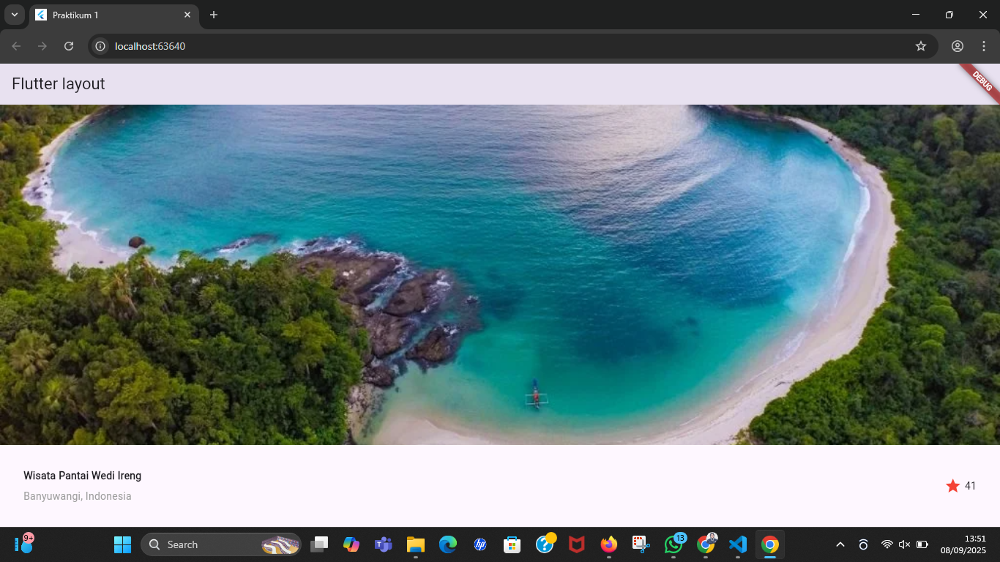
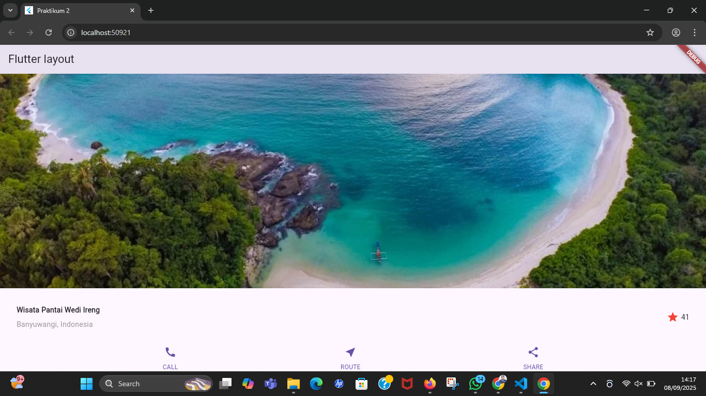
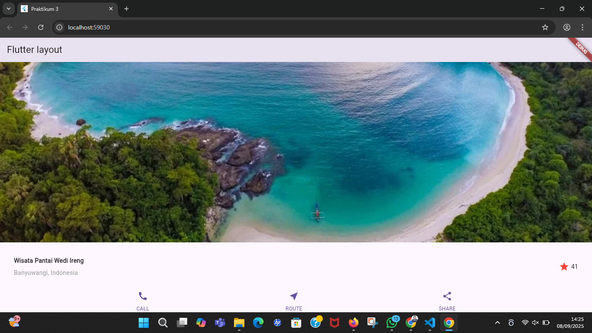
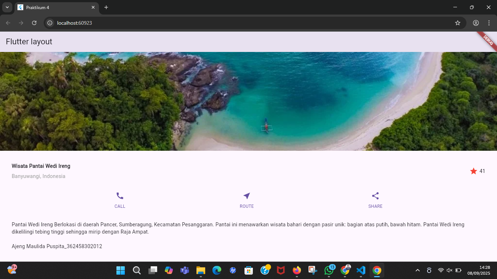

# TUGAS PRAKTIKUM 1 - LAYOUT BASICS
- Identitas: Ajeng Maulida Puspita  
- NIM      : 362458302012  

---

# Praktikum 1 - Membuat Struktur Dasar Layout
## Penjelasan
1. Menambahkan image pada bagian atas layout.  
2. Membuat title section menggunakan Row yang berisi column di sebelah kiri untuk menampilkan:  
    - Judul *'Wisata Pantai Wedi Ireng'* (dengan teks tebal)  
    - Lokasi *'Banyuwangi, Indonesia'* (dengan teks abu-abu)  
3. Kemudian di sebelah kanan, ditambahkan ikon bintang merah dan teks *41*.  

## Screenshot

---

# Praktikum 2 - Menambahkan Button Row
## Penjelasan
1. Menambahkan button section berupa Row dengan tiga tombol.  
2. Kemudian tiap tombol dibangun dengan fungsi buildButtonColumn, berisi ikon dan teks label.  
3. Tombol yang ditambahkan:  
    - 📞 CALL  
    - 📍 ROUTE  
    - 🔗 SHARE  

## Screenshot

---

# Praktikum 3 - Styling & Alignment
## Penjelasan
1. Menambahkan padding pada tiap section (EdgeInsets.all(32)).  
2. Mengatur crossAxisAlignment: CrossAxisAlignment.start agar teks rata kiri.  
3. Menambahkan margin (EdgeInsets.only(top: 8)) pada teks label tombol agar lebih rapi.  
4. Memberi style teks judul *tebal* dan lokasi *abu-abu*.  
5. Hasil layout lebih seimbang dan rapi.  

## Screenshot

---

# Praktikum 4 - Layout Final (ListView + Deskripsi)
## Penjelasan
1. Semua section (image, title, button row, text) dimasukkan ke dalam *ListView* agar dapat di-scroll.  
2. Menambahkan deskripsi panjang di bawah button row.  
3. Deskripsi menggunakan properti softWrap: true agar teks otomatis pindah baris.  
4. Layout sudah responsif, rapi, dan sesuai instruksi codelab.  

## Screenshot
